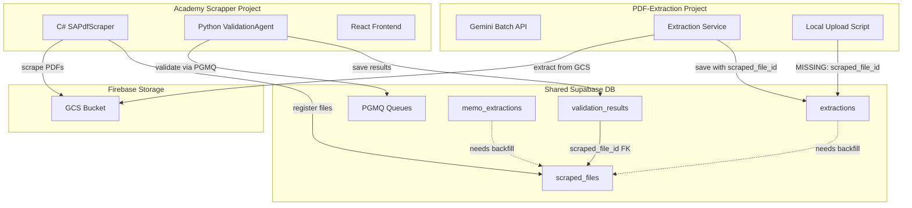

# Database Consistency and Linkage Fix Plan

## Problem Summary

1. **70 extractions** and **62 memo_extractions** have `scraped_file_id = NULL`
2. These were uploaded from local JSON files without linking to source `scraped_files` records
3. `scraped_files` contains Firebase storage paths needed for end-to-end traceability
4. Two projects share the same Supabase database:
  - **PDF-Extraction** (this project) - Python FastAPI extraction service
  - **Academy Scrapper** - C# scraper + Python ValidationAgent + React frontend

## Database Schema Overview

### Public Schema (26 tables)

**Core Content:**

- `scraped_files` (35,944 rows) - Source PDFs with Firebase storage paths
- `extractions` (70 rows) - Extracted question papers (needs `scraped_file_id` backfill)
- `memo_extractions` (62 rows) - Extracted marking guidelines (needs backfill)
- `validation_results` (10,554 rows) - Validation outcomes (has proper `scraped_file_id` links)

**Job Tracking:**

- `batch_jobs`, `gemini_batch_jobs`, `validation_jobs`, `extraction_jobs`

**Relationships:**

- `exam_sets` - QP + Memo pairs
- `document_sections`, `document_versions`

**PGMQ Schema (Message Queues):**

- `a_validation_queue`, `a_validation_queue_high`, `a_extraction_queue`, `a_validation_dead_letter`

## Implementation Plan

### 1. Create Backfill Script

Create `[scripts/backfill_scraped_file_ids.py](scripts/backfill_scraped_file_ids.py)` to link orphan extractions:

**Matching Strategy (in order of priority):**

1. **Hash prefix match** - extraction filename prefix (first 12 chars of file_hash) may appear in scraped_files
2. **Filename normalization** - strip hash prefix and match cleaned filename
3. **Metadata match** - subject + year + grade + session (when unique)

**Key Code Pattern:**

```python
# Match by normalized filename (remove hash prefix)
clean_name = re.sub(r'^[a-f0-9]{12}-', '', extraction['file_name'])
match = client.table("scraped_files").select("id, storage_path")
    .ilike("filename", f"%{clean_name}%")
    .eq("validation_status", "validated")
    .maybe_single().execute()
```

### 2. Update Upload Script

Modify `[scripts/upload_local_extractions.py](scripts/upload_local_extractions.py)` to:

- Look up `scraped_file_id` before creating extraction
- Match by filename or metadata
- Set `scraped_file_id` in `file_info` dict

### 3. Update Documentation

Update `[AGENTS.md](AGENTS.md)` with:

- Full database schema including PGMQ queues
- All 26 public tables with descriptions
- Academy Scrapper project relationship
- Storage path reference info

Update `[.cursor/rules/project-context.mdc](.cursor/rules/project-context.mdc)` with:

- Complete table list and record counts
- Cross-project architecture diagram
- `scraped_file_id` linkage requirements

### 4. Cursor Rule Already Created

The rule `[.cursor/rules/supabase-schema-check.mdc](.cursor/rules/supabase-schema-check.mdc)` already enforces:

- Query `user-supabase-list_tables` before schema changes
- Check foreign key relationships
- Verify record counts before destructive operations

## Data Flow Diagram




## Files to Modify


| File                                   | Action                                  |
| -------------------------------------- | --------------------------------------- |
| `scripts/backfill_scraped_file_ids.py` | **CREATE** - Backfill script            |
| `scripts/upload_local_extractions.py`  | **MODIFY** - Add scraped_file_id lookup |
| `AGENTS.md`                            | **UPDATE** - Full schema docs           |
| `.cursor/rules/project-context.mdc`    | **UPDATE** - Architecture diagram       |


