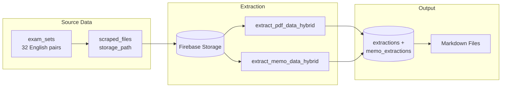

# Extract and Export Matched English Exam Pairs

## Current State

- **32 matched English exam_sets** in database (QP + Memo pairs)
- Only **3 have QP extractions**, **0 have memo extractions**
- All files exist in Firebase Storage with valid `storage_path`

## Data Flow




## Implementation

### Step 1: Create Extraction Script for Matched Pairs

Create `[scripts/extract_matched_pairs.py](scripts/extract_matched_pairs.py)` that:

1. **Queries exam_sets** filtered by subject and status
2. **Downloads PDFs** from Firebase Storage using `storage_path`
3. **Runs extraction** via existing pipeline:
  - `extract_pdf_data_hybrid()` for question papers
  - `extract_memo_data_hybrid()` for memos
4. **Saves to database** with `scraped_file_id` linkage

Key code to leverage:

- `[app/services/firebase_client.py](app/services/firebase_client.py)` - `download_as_bytes()`
- `[app/services/pdf_extractor.py](app/services/pdf_extractor.py)` - `extract_pdf_data_hybrid()`
- `[app/services/memo_extractor.py](app/services/memo_extractor.py)` - `extract_memo_data_hybrid()`
- `[app/db/extractions.py](app/db/extractions.py)` - `create_extraction()`
- `[app/db/memo_extractions.py](app/db/memo_extractions.py)` - `create_memo_extraction()`

### Step 2: Update Export Script

Modify `[scripts/export_extractions_md.py](scripts/export_extractions_md.py)` to:

1. Add `--exam-sets` mode that:
  - Fetches exam_sets with linked extractions
  - Retrieves full extraction JSON from `extractions` and `memo_extractions`
  - Converts to markdown using existing `qp_to_markdown()` and `memo_to_markdown()`
2. Output paired markdown files: `{subject}-{year}-p{paper}-qp.md` and `{subject}-{year}-p{paper}-mg.md`

### CLI Usage

```bash
# Step 1: Run extraction on matched English pairs
python scripts/extract_matched_pairs.py --subject english --status matched --limit 10

# Step 2: Export to markdown
python scripts/export_extractions_md.py --exam-sets --subject english
```

## Files to Create/Modify


| File                               | Action | Purpose                                         |
| ---------------------------------- | ------ | ----------------------------------------------- |
| `scripts/extract_matched_pairs.py` | Create | Extract matched exam_sets from Firebase         |
| `scripts/export_extractions_md.py` | Modify | Add exam_sets mode with full extraction content |


## Dependencies

- `SUPABASE_SERVICE_ROLE_KEY` in `.env` (for RLS bypass)
- `GOOGLE_API_KEY` in `.env` (for Gemini extraction)
- Firebase credentials configured

