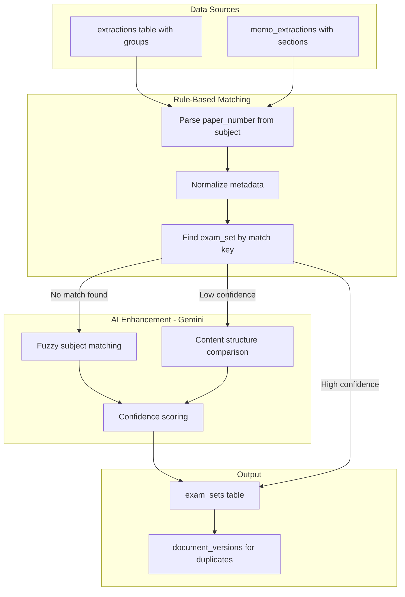

# AI-Enhanced Exam Set Matching from Extracted Files

## Current State

The existing `batch_matcher.py` matches from `validation_results` which has:

- 10,554 records but limited metadata quality
- `session` often missing (defaulted to "Unknown")
- `grade` sometimes NULL (derived from `level`)
- `paper_number` available but sometimes incorrect
- **No content comparison** - purely metadata-based

The extracted files have richer, AI-extracted metadata AND content:

- **255 extractions** (Question Papers) - all with `scraped_file_id`
- **212 memo_extractions** (Memos) - all with `scraped_file_id`
- Better `subject`, `grade`, `year`, `session`, `syllabus` from full PDF analysis
- `paper_number` embedded in subject (e.g., "Business Studies P1")
- **Question groups/sections with actual content** for intelligent matching

## Architecture




## Implementation Plan

### 1. Add paper_number extraction utility

**File:** `[app/utils/normalizers.py](C:\Users\theoc\Desktop\Work\AcademyScrapper-Unified\services\extraction-service\app\utils\normalizers.py)`

Add function to extract paper number from subject strings:

```python
def extract_paper_number_from_subject(subject: str) -> tuple[str, int]:
    """
    Extract paper number from subject like 'Business Studies P1' -> ('Business Studies', 1).
    Returns (clean_subject, paper_number). Defaults paper_number to 1 if not found.
    """
    pattern = r'\s*[Pp](?:aper)?\s*(\d+)\s*$'
    match = re.search(pattern, subject)
    if match:
        paper_num = int(match.group(1))
        clean_subject = re.sub(pattern, '', subject).strip()
        return clean_subject, paper_num
    return subject.strip(), 1
```

### 2. Expand subject normalization mappings

**File:** `[app/utils/normalizers.py](C:\Users\theoc\Desktop\Work\AcademyScrapper-Unified\services\extraction-service\app\utils\normalizers.py)`

Add more subject mappings to handle variations in extracted data:

```python
SUBJECT_MAPPINGS: dict[str, str] = {
    # Existing mappings...
    # Add new mappings for extracted subjects:
    "further mathematics": "Further Mathematics",
    "further maths": "Further Mathematics",
    "additional mathematics": "Additional Mathematics",
    "design": "Design",
    "isizulu": "IsiZulu",
    "sesotho": "Sesotho",
    "life orientation": "Life Orientation",
    "lewensorientering": "Life Orientation",  # Afrikaans
    # ... more as needed
}
```

### 3. Normalize session values consistently

**File:** `[app/utils/normalizers.py](C:\Users\theoc\Desktop\Work\AcademyScrapper-Unified\services\extraction-service\app\utils\normalizers.py)`

Update session mappings to handle extraction formats:

```python
SESSION_MAPPINGS: dict[str, str] = {
    # Existing...
    "may/june": "May/June",
    "november": "November",
    "unknown": "Unknown",
    "": "Unknown",
}
```

### 4. Create Gemini-powered matcher service

**File:** `[app/services/gemini_matcher.py](C:\Users\theoc\Desktop\Work\AcademyScrapper-Unified\services\extraction-service\app\services\gemini_matcher.py)` (new)

This service provides AI-enhanced matching capabilities:

```python
"""
Gemini-powered intelligent matching for exam documents.
Uses AI to handle fuzzy matching, subject normalization, and content comparison.
"""

from google import genai
from google.genai import types
from typing import Optional
import json

MATCH_SYSTEM_INSTRUCTION = """You are an exam document matching expert for South African and UK exam papers.
Your task is to determine if two documents (Question Paper and Memo) belong together.

Consider:
1. Subject name variations (e.g., "Maths" = "Mathematics", "Life Science" = "Biology")
2. Paper numbers embedded in titles (e.g., "Business Studies P1" = Paper 1)
3. Session/term variations (e.g., "May/June" = "June", "Nov" = "November")
4. Syllabus variations (NSC, IEB, Cambridge, etc.)
5. Question structure alignment (same number of questions, similar marks)

Return JSON only."""

async def normalize_subject_with_ai(
    client: genai.Client,
    subject: str,
) -> dict:
    """Use Gemini to normalize ambiguous subject names."""
    prompt = f"""Normalize this exam subject name to a standard form.
    
Subject: "{subject}"

Return JSON:
{{
  "normalized": "Standard Subject Name",
  "paper_number": 1,  // extracted from subject if present (P1, P2, etc.)
  "language": "English",  // if language variant detected (HL, FAL, etc.)
  "confidence": 0.95
}}"""
    
    response = await client.aio.models.generate_content(
        model="gemini-2.0-flash",
        contents=prompt,
        config=types.GenerateContentConfig(
            response_mime_type="application/json",
            temperature=0,
        )
    )
    return json.loads(response.text)


async def compare_documents_for_match(
    client: genai.Client,
    qp_metadata: dict,
    memo_metadata: dict,
    qp_structure: dict,  # groups from extraction
    memo_structure: dict,  # sections from memo_extraction
) -> dict:
    """Use Gemini to compare QP and Memo for matching."""
    prompt = f"""Compare these exam documents and determine if they match.

QUESTION PAPER:
- Subject: {qp_metadata.get('subject')}
- Grade: {qp_metadata.get('grade')}
- Year: {qp_metadata.get('year')}
- Session: {qp_metadata.get('session')}
- Syllabus: {qp_metadata.get('syllabus')}
- Total Marks: {qp_metadata.get('total_marks')}
- Number of Groups: {len(qp_structure.get('groups', []))}

MEMORANDUM:
- Subject: {memo_metadata.get('subject')}
- Grade: {memo_metadata.get('grade')}
- Year: {memo_metadata.get('year')}
- Session: {memo_metadata.get('session')}
- Total Marks: {memo_metadata.get('total_marks')}
- Number of Sections: {len(memo_structure.get('sections', []))}

Return JSON:
{{
  "is_match": true/false,
  "confidence": 0.0-1.0,
  "reasoning": "Brief explanation",
  "normalized_subject": "Standard subject name for both",
  "paper_number": 1,
  "issues": ["List any concerns"]
}}"""

    response = await client.aio.models.generate_content(
        model="gemini-2.0-flash",
        contents=prompt,
        config=types.GenerateContentConfig(
            response_mime_type="application/json",
            temperature=0,
        )
    )
    return json.loads(response.text)


async def find_best_memo_match(
    client: genai.Client,
    qp_data: dict,
    candidate_memos: list[dict],
) -> Optional[dict]:
    """Given a QP, find the best matching memo from candidates using AI."""
    if not candidate_memos:
        return None
    
    candidates_summary = "\n".join([
        f"- ID: {m['id']}, Subject: {m['subject']}, Year: {m['year']}, Session: {m['session']}"
        for m in candidate_memos[:10]  # Limit to 10 candidates
    ])
    
    prompt = f"""Find the best matching memorandum for this question paper.

QUESTION PAPER:
- Subject: {qp_data.get('subject')}
- Grade: {qp_data.get('grade')}
- Year: {qp_data.get('year')}
- Session: {qp_data.get('session')}
- Syllabus: {qp_data.get('syllabus')}

CANDIDATE MEMOS:
{candidates_summary}

Return JSON:
{{
  "best_match_id": "uuid or null if no good match",
  "confidence": 0.0-1.0,
  "reasoning": "Why this memo matches"
}}"""

    response = await client.aio.models.generate_content(
        model="gemini-2.0-flash",
        contents=prompt,
        config=types.GenerateContentConfig(
            response_mime_type="application/json",
            temperature=0,
        )
    )
    return json.loads(response.text)
```

### 5. Create extraction-based batch matcher (AI-enhanced)

**File:** `[app/services/extraction_batch_matcher.py](C:\Users\theoc\Desktop\Work\AcademyScrapper-Unified\services\extraction-service\app\services\extraction_batch_matcher.py)` (new)

```python
async def run_extraction_batch_matcher(
    client: Optional[Client] = None,
    limit: int = 500,
    dry_run: bool = False,
    ai_assist: bool = True,  # Enable AI enhancement
    ai_threshold: float = 0.7,  # Use AI when rule-based confidence < threshold
    progress_interval: int = 50,
) -> Dict[str, int]:
    """
    Match extractions and memo_extractions to exam_sets.
    
    Hybrid approach:
    1. Try rule-based matching first (fast, free)
    2. If no match or low confidence, use Gemini AI (slower, costs tokens)
    """
```

**Matching Strategy:**

```python
async def _match_extraction(extraction: dict, ai_assist: bool) -> MatchResult:
    # Step 1: Parse and normalize metadata
    clean_subject, paper_number = extract_paper_number_from_subject(extraction["subject"])
    normalized = {
        "subject": normalize_subject(clean_subject),
        "grade": normalize_grade(extraction["grade"]),
        "year": extraction["year"],
        "session": normalize_session(extraction["session"] or ""),
        "syllabus": extraction.get("syllabus"),
        "paper_number": paper_number,
        "paper_type": "Question Paper",
    }
    
    # Step 2: Try rule-based match
    existing = await find_exam_set_by_match_key(supabase, **normalized)
    if existing:
        return MatchResult(exam_set_id=existing["id"], method="rule", confidence=1.0)
    
    # Step 3: AI-assisted matching (if enabled and no rule match)
    if ai_assist:
        # Use Gemini to normalize ambiguous subject
        ai_normalized = await normalize_subject_with_ai(gemini, extraction["subject"])
        if ai_normalized["confidence"] > ai_threshold:
            normalized["subject"] = ai_normalized["normalized"]
            normalized["paper_number"] = ai_normalized.get("paper_number", paper_number)
            
            # Retry with AI-normalized subject
            existing = await find_exam_set_by_match_key(supabase, **normalized)
            if existing:
                return MatchResult(method="ai_normalized", confidence=ai_normalized["confidence"])
        
        # Find candidate memos and use AI to pick best match
        candidates = await find_candidate_memos(supabase, normalized)
        if candidates:
            best = await find_best_memo_match(gemini, extraction, candidates)
            if best and best["confidence"] > ai_threshold:
                return MatchResult(method="ai_matched", confidence=best["confidence"])
    
    # Step 4: Create new exam_set (no match found)
    return MatchResult(method="created", confidence=1.0)
```

Key logic:

1. Query `extractions` table for records not yet linked to `exam_sets`
2. Query `memo_extractions` table for records not yet linked to `exam_sets`
3. For each record:
  - Extract `paper_number` from `subject` using new utility
  - Normalize all metadata fields
  - **Try rule-based match first** (free, fast)
  - **If no match and ai_assist=True**: Use Gemini for fuzzy matching
  - Create/update exam_set with match confidence and method
4. Track stats: scanned, matched_rule, matched_ai, created, errors

### 6. Add DB query functions for extractions

**File:** `[app/db/extractions.py](C:\Users\theoc\Desktop\Work\AcademyScrapper-Unified\services\extraction-service\app\db\extractions.py)` (new or extend)

```python
async def list_unlinked_extractions(
    client: Client, 
    limit: int = 500,
    offset: int = 0
) -> tuple[List[Dict], int]:
    """List extractions whose scraped_file_id is not in any exam_set."""
    
async def list_unlinked_memo_extractions(
    client: Client,
    limit: int = 500, 
    offset: int = 0
) -> tuple[List[Dict], int]:
    """List memo_extractions whose scraped_file_id is not in any exam_set."""
```

### 7. Create CLI script

**File:** `[scripts/run_extraction_batch_matcher.py](C:\Users\theoc\Desktop\Work\AcademyScrapper-Unified\services\extraction-service\scripts\run_extraction_batch_matcher.py)` (new)

```python
"""CLI to run AI-enhanced extraction-based batch matching."""
import argparse
import asyncio
from app.services.extraction_batch_matcher import run_extraction_batch_matcher

def main():
    parser = argparse.ArgumentParser(description="Match extractions to exam_sets with optional AI assistance")
    parser.add_argument("--dry-run", action="store_true", help="Simulate without DB writes")
    parser.add_argument("--limit", type=int, default=500, help="Max records to process")
    parser.add_argument("--no-ai", action="store_true", help="Disable AI-assisted matching")
    parser.add_argument("--ai-threshold", type=float, default=0.7, help="AI confidence threshold (0.0-1.0)")
    args = parser.parse_args()
    
    stats = asyncio.run(run_extraction_batch_matcher(
        limit=args.limit,
        dry_run=args.dry_run,
        ai_assist=not args.no_ai,
        ai_threshold=args.ai_threshold,
    ))
    print(f"Results: {stats}")

if __name__ == "__main__":
    main()
```

**Usage Examples:**

```bash
# Dry run with AI (default)
python scripts/run_extraction_batch_matcher.py --dry-run

# Run without AI (rule-based only, faster, free)
python scripts/run_extraction_batch_matcher.py --no-ai

# Run with higher AI confidence threshold
python scripts/run_extraction_batch_matcher.py --ai-threshold 0.85

# Process limited batch
python scripts/run_extraction_batch_matcher.py --limit 50
```

### 8. Update documentation

**File:** `[AGENTS.md](c:\Users\theoc\Desktop\Work\PDF-Extraction\AGENTS.md)`

Add new script documentation under "Paper Matching" section.

## Data Flow


| Source             | Records | Has scraped_file_id | Paper Type     |
| ------------------ | ------- | ------------------- | -------------- |
| `extractions`      | 255     | 255 (100%)          | Question Paper |
| `memo_extractions` | 212     | 212 (100%)          | Memorandum     |
| **Total**          | **467** | **467**             | -              |


## Key Improvements Over Current Approach

1. **Better metadata quality**: AI-extracted from full PDF content vs cover page only
2. **Paper number extraction**: Parse "P1", "P2" from subject strings
3. **Known paper types**: `extractions` = QP, `memo_extractions` = Memo (no guessing)
4. **Syllabus available**: Extractions have syllabus field populated
5. **Session data**: Better session values from full document analysis
6. **AI-powered fuzzy matching**: Gemini handles subject variations, ambiguous metadata
7. **Content-aware matching**: Can compare question structures between QP and Memo
8. **Confidence scoring**: Track match quality for review

## AI Enhancement Benefits


| Scenario                            | Rule-Based         | AI-Enhanced       |
| ----------------------------------- | ------------------ | ----------------- |
| "Maths P1" vs "Mathematics Paper 1" | Miss               | Match             |
| "Life Science" vs "Biology"         | Miss               | Match             |
| "Nov" vs "November"                 | Depends on mapping | Match             |
| Ambiguous subject names             | Error              | Normalized        |
| Find best memo for QP               | N/A                | Ranked candidates |


**Cost Considerations:**

- Rule-based matching: Free (no API calls)
- AI matching: ~0.001-0.005 USD per document (Gemini 2.0 Flash)
- Hybrid approach: AI only when rule-based fails (~10-20% of documents)
- Estimated cost for 467 documents: $0.50-2.00 total

## Files to Create/Modify


| File                                       | Action                                                              |
| ------------------------------------------ | ------------------------------------------------------------------- |
| `app/utils/normalizers.py`                 | Modify - add `extract_paper_number_from_subject()`, expand mappings |
| `app/services/gemini_matcher.py`           | Create - AI-powered matching functions                              |
| `app/services/extraction_batch_matcher.py` | Create - hybrid batch matcher                                       |
| `app/db/extractions.py`                    | Create/Extend - query functions                                     |
| `scripts/run_extraction_batch_matcher.py`  | Create - CLI script with AI flags                                   |
| `AGENTS.md`                                | Modify - add documentation                                          |


