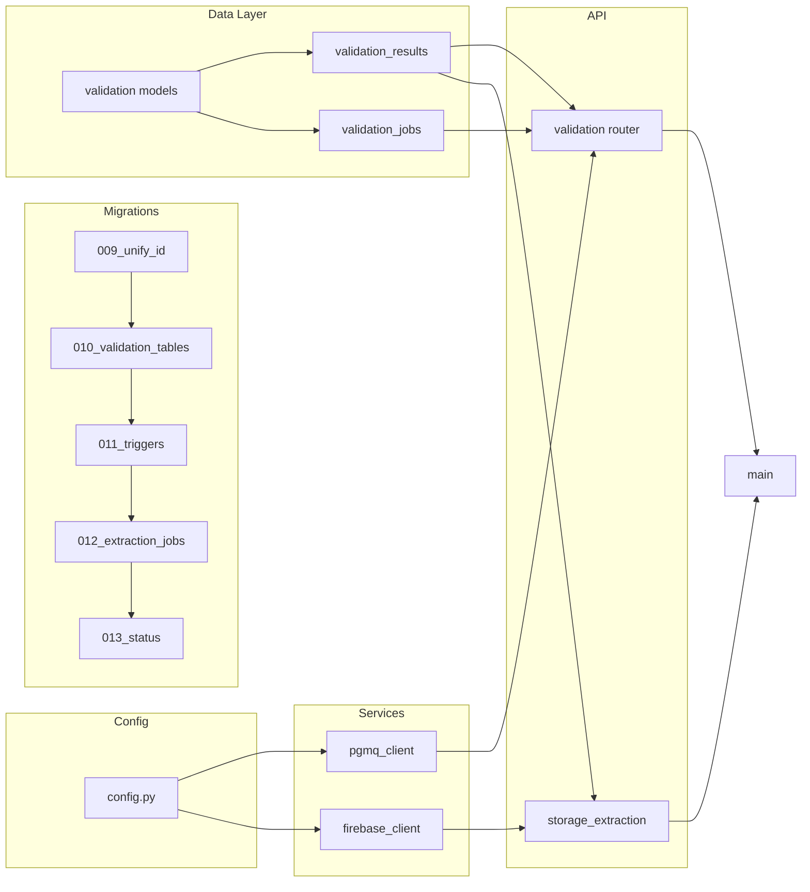

# Unified PDF Extraction – PDF-Extraction Repo Implementation Plan

**Scope:** This plan covers only the **PDF-Extraction** codebase (`c:\Users\theoc\Desktop\Work\PDF-Extraction`). The PRD also defines work in Academy Scrapper (C#/.NET + ValidationAgent); that work is a separate phase and not included here.

**Reference:** [tasks/prd-unified-pdf-extraction-system.md](tasks/prd-unified-pdf-extraction-system.md)

---

## Phase 1: Database migrations (run in order)

Migrations assume a shared Supabase PostgreSQL database. Tables `parsed_questions` and `parser_jobs` are Academy Scrapper tables in the same DB.

| Task | File                                     | PRD            | Description                                                                                                                                                                                                                                                                                                                                                                                                                                                         |
| ---- | ---------------------------------------- | -------------- | ------------------------------------------------------------------------------------------------------------------------------------------------------------------------------------------------------------------------------------------------------------------------------------------------------------------------------------------------------------------------------------------------------------------------------------------------------------------- |
| 1.1  | `migrations/009_unify_id_tracking.sql`   | US-001, US-013 | Add `scraped_file_id UUID` FK to `parsed_questions` and `parser_jobs` (references `scraped_files(id)`). Retain legacy `file_id` TEXT. Include data migration: populate `scraped_file_id` from existing `file_id` lookup. Indexes on new columns.                                                                                                                                                                                                                    |
| 1.2  | `migrations/010_validation_tables.sql`   | US-002, US-003 | Create `validation_results` (scraped_file_id PK/FK, status, confidence_score, subject, grade, year, paper_type, paper_number, session, syllabus, metadata). Status constraint: correct, rejected, review_required, pending, error. Create `validation_jobs` (progress: total_files, processed_files, accepted_files, rejected_files, review_required_files, failed_files; status: pending, queued, running, completed, failed, paused, cancelled). Indexes per PRD. |
| 1.3  | `migrations/011_validation_triggers.sql` | US-005, US-008 | Trigger on `scraped_files.status` → 'downloaded': enqueue to PGMQ `validation_queue` (scraped_file_id, storage_url, file_name, triggered_at), set scraped_files.status = 'validating'. Trigger on `validation_results.status` → 'correct': enqueue to PGMQ `extraction_queue` (scraped_file_id, storage_url, document_type, metadata), set scraped_files.status = 'queued_for_extraction'. Requires PGMQ extension.                                                 |
| 1.4  | `migrations/012_extraction_jobs.sql`     | US-004         | Create `extraction_jobs` with scraped_file_id UUID FK, job_type ('extraction','memo_extraction','parsing'), status, priority, started_at, completed_at, items_extracted, errors_count. Migrate data from legacy `parser_jobs` if present.                                                                                                                                                                                                                           |
| 1.5  | `migrations/013_status_updates.sql`      | US-012         | Update `scraped_files` status check constraint to include: pending, downloading, downloaded, validating, validated, queued_for_extraction, extracting, completed, review_required, rejected, failed. Add `validation_status` column: unvalidated, queued, validated, rejected, review_required, failed. Preserve existing status values. Document status transitions in migration comment.                                                                          |

---

## Phase 2: Config and shared settings

| Task | File            | PRD            | Description                                                                                                                                                                                                                                                                                                      |
| ---- | --------------- | -------------- | ---------------------------------------------------------------------------------------------------------------------------------------------------------------------------------------------------------------------------------------------------------------------------------------------------------------- |
| 2.1  | `app/config.py` | US-014, US-015 | Add PGMQ connection settings (e.g. database URL or same Supabase, queue names: validation_queue, extraction_queue, validation_dead_letter, visibility timeout). Add Firebase config: service account path or JSON env, bucket; support `gs://` URL format. All optional with sensible defaults where applicable. |

---

## Phase 3: New services

| Task | File                              | PRD    | Description                                                                                                                                                                                                                  |
| ---- | --------------------------------- | ------ | ---------------------------------------------------------------------------------------------------------------------------------------------------------------------------------------------------------------------------- |
| 3.1  | `app/services/pgmq_client.py`     | US-014 | PGMQ client: send, read (with visibility timeout), delete, archive. Connection pooling for async. Dead letter queue support for failed messages. Use config for queue names and timeouts.                                    |
| 3.2  | `app/services/firebase_client.py` | US-015 | Firebase Storage client: download from `gs://` or storage path, optional streaming for large files. Rename operation (copy + delete). Auth via service account JSON from config. Handle missing files and permission errors. |

---

## Phase 4: Validation data layer and models

| Task | File                           | PRD    | Description                                                                                                                                                                                   |
| ---- | ------------------------------ | ------ | --------------------------------------------------------------------------------------------------------------------------------------------------------------------------------------------- |
| 4.1  | `app/models/validation.py`     | US-010 | Pydantic models: validation result (status, confidence_score, subject, grade, year, etc.), validation job (progress counts, status), batch request/response, review resolve request/response. |
| 4.2  | `app/db/validation_results.py` | US-002 | CRUD: create, get by scraped_file_id, update status and metadata, list for review queue with pagination.                                                                                      |
| 4.3  | `app/db/validation_jobs.py`    | US-003 | CRUD: create job, get by id, update progress counts and status.                                                                                                                               |

---

## Phase 5: Storage extraction endpoint

| Task | File                                | PRD    | Description                                                                                                                                                                                                                                                                                                                                                                                                                                                              |
| ---- | ----------------------------------- | ------ | ------------------------------------------------------------------------------------------------------------------------------------------------------------------------------------------------------------------------------------------------------------------------------------------------------------------------------------------------------------------------------------------------------------------------------------------------------------------------ |
| 5.1  | `app/routers/storage_extraction.py` | US-009 | `POST /api/extract/from-storage`: body/params scraped_file_id, storage_url, doc_type (optional), webhook_url (optional). Download PDF via firebase_client, then run extraction (reuse existing pipeline). Pass scraped_file_id in file_info; when doc_type provided, skip classification (same as existing [app/routers/extraction.py](app/routers/extraction.py) behavior). Return 202 with extraction_id and status processing; trigger webhook on completion/failure. |
| 5.2  | Extraction flow                     | US-009 | Ensure from-storage path passes scraped_file_id in file_info (already supported in [app/db/extractions.py](app/db/extractions.py) and [app/db/memo_extractions.py](app/db/memo_extractions.py)). No change to pdf_extractor/classifier if from-storage router performs classification skip at router level (same as upload flow).                                                                                                                                        |

---

## Phase 6: Validation and review API

| Task | File                        | PRD            | Description                                                                                                                                                                                                                                                                                                                                                                                                                                                                                                                                                                                |
| ---- | --------------------------- | -------------- | ------------------------------------------------------------------------------------------------------------------------------------------------------------------------------------------------------------------------------------------------------------------------------------------------------------------------------------------------------------------------------------------------------------------------------------------------------------------------------------------------------------------------------------------------------------------------------------------ |
| 6.1  | `app/routers/validation.py` | US-010, US-011 | Endpoints: `POST /api/validation/batch` (trigger batch validation for given files); `GET /api/validation/{job_id}` (job status + progress); `GET /api/validation/{job_id}/progress` (lightweight polling + ETA); `GET /api/validation/result/{scraped_file_id}` (single result); `GET /api/validation/review-queue` (paginated list); `POST /api/validation/review/{scraped_file_id}/resolve` (approve/reject + notes, update validation_results, trigger extraction if approved, metadata override). Use validation_results and validation_jobs CRUD; return JSON with documented schema. |
| 6.2  | `app/main.py`               | US-010         | Register validation router. Add PGMQ lifespan hooks (startup: ensure queues exist or connect; shutdown: cleanup) if required by pgmq_client.                                                                                                                                                                                                                                                                                                                                                                                                                                               |

---

## Phase 7: Optional pipeline tweaks (only if needed)

| Task | File                                  | PRD    | Description                                                                                                                                                                                                                                                       |
| ---- | ------------------------------------- | ------ | ----------------------------------------------------------------------------------------------------------------------------------------------------------------------------------------------------------------------------------------------------------------- |
| 7.1  | `app/services/pdf_extractor.py`       | US-009 | Add optional `doc_type: Optional[str] = None` (or skip_classification flag) only if a shared “run extraction from file” path is introduced that currently always classifies; otherwise no change (router already skips classification when doc_type is provided). |
| 7.2  | `app/services/document_classifier.py` | US-009 | Allow bypass when doc_type provided only if extraction pipeline is refactored to call classifier internally with a bypass; otherwise no change.                                                                                                                   |

**Decision:** Implement 5.1 by having the from-storage router download the file then call the same logical steps as the existing extract endpoint (validate doc_type, run extraction without calling classifier when doc_type is set, pass scraped_file_id in file_info). Then 7.1 and 7.2 can be “no change” unless a shared helper is added that always classifies.

---

## Execution order summary

1. Migrations 009 → 010 → 011 → 012 → 013 (in order).
2. Config (2.1).
3. PGMQ client (3.1), Firebase client (3.2).
4. Validation models (4.1), validation_results CRUD (4.2), validation_jobs CRUD (4.3).
5. Storage extraction router (5.1) and wiring; confirm extraction flow (5.2).
6. Validation router (6.1), main.py registration and PGMQ lifespan (6.2).
7. Pipeline tweaks (7.1, 7.2) only if refactor introduces a shared path that needs skip_classification.

---

## Out of scope (this plan)

- Academy Scrapper repo: ValidationAgent (file_renamer, validate_worker, validate_gemini, supabase_client, config), C# services (SupabaseParsedQuestionsService, SupabaseScrapedFilesService, DirectPageScraperService, ExtractionApiClient), and Academy DB migration `phase3_unification.sql`.
- Running migrations in Supabase (plan only creates migration files; apply via Dashboard or existing apply script).
- End-to-end or integration tests (unless you add a separate task for them).
- Cost tracking table, retention policy, validation caching, or handling of post-validation extraction failures (open questions in PRD).

---

## Dependency diagram

