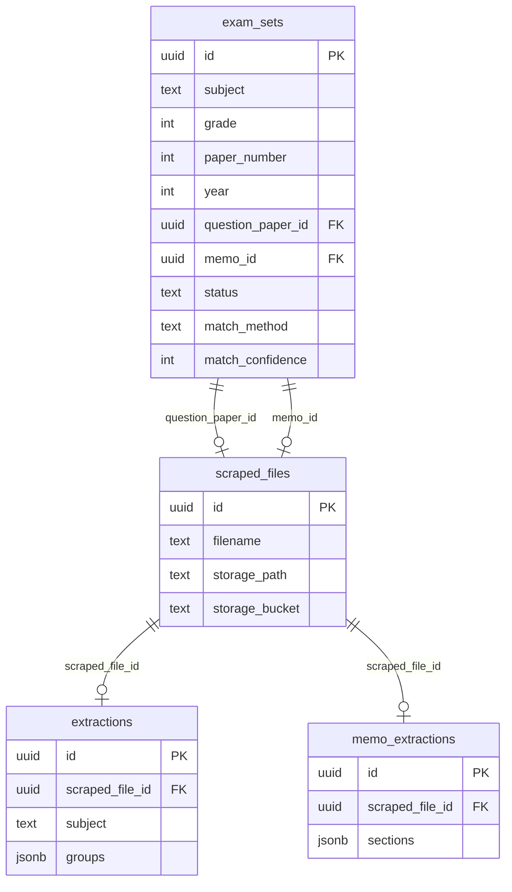

# Exam Sets — Database & Pipeline Overview

Presentation-ready reference for the `exam_sets` table, related tables, SQL queries, and CLI usage.

**Last updated:** 2026-02-06

---

## 1. Executive Summary

| Metric | Value |
|--------|-------|
| **Total exam_sets** | 3,626 |
| **Complete pairs (QP + Memo linked)** | 1,121 |
| **QP only** | 1,585 |
| **Memo only** | 920 |
| **Fully matched** (status = `matched`) | 435 |

**Pipeline:** Scrape PDFs → Validate → Match (QP ↔ Memo) → Extract (AI) → Export to Markdown

Top subjects by total exam_sets: Mathematics (377), Physical Sciences (199), Chemistry (193), Life Sciences (183), History (163).

---

## 2. `exam_sets` Table Schema

All 16 columns as defined in the database:

| Column | Type | Nullable | Default | Description |
|--------|------|----------|---------|-------------|
| `id` | uuid | NO | `gen_random_uuid()` | Primary key |
| `subject` | text | NO | — | Subject name (e.g. Mathematics, English Literature) |
| `grade` | integer | NO | — | Grade (e.g. 12) |
| `paper_number` | integer | NO | — | Paper number (1, 2, 3, etc.) |
| `year` | integer | NO | — | Exam year (e.g. 2024) |
| `session` | text | NO | — | Session (e.g. Unknown, JUNE, Nov) |
| `syllabus` | text | YES | — | Syllabus (e.g. NSC, IEB, Other) |
| `question_paper_id` | uuid | YES | — | FK → `scraped_files.id` (QP PDF) |
| `memo_id` | uuid | YES | — | FK → `scraped_files.id` (Memo PDF) |
| `match_method` | text | YES | — | `automatic` \| `manual` \| `filename` \| `content` |
| `match_confidence` | integer | YES | — | 0–100 |
| `matched_at` | timestamptz | YES | — | When the pair was matched |
| `matched_by` | text | YES | — | e.g. `system` |
| `status` | text | YES | `'incomplete'` | `incomplete` \| `matched` \| `verified` \| `mismatch` \| `duplicate_review` |
| `created_at` | timestamptz | YES | `now()` | Row creation time |
| `updated_at` | timestamptz | YES | `now()` | Last update time |

**Constraints:**

- `exam_sets_match_method_check`: `match_method` IN ('automatic', 'manual', 'filename', 'content')
- `exam_sets_match_confidence_check`: `match_confidence` BETWEEN 0 AND 100
- `exam_sets_status_check`: `status` IN ('incomplete', 'matched', 'verified', 'mismatch', 'duplicate_review')
- `exam_sets_question_paper_id_fkey`: `question_paper_id` → `scraped_files(id)`
- `exam_sets_memo_id_fkey`: `memo_id` → `scraped_files(id)`

---

## 3. Table Relationships



- **exam_sets** links one Question Paper and one Memo via `scraped_files`.
- **extractions** and **memo_extractions** link to the same `scraped_files` via `scraped_file_id` (extracted content for that PDF).

---

## 3b. Validation, Extraction & Linking — Pipeline Tables and Schema

End-to-end flow and how the tables relate:

| Stage | Tables | Relationship |
|-------|--------|--------------|
| **Source** | `scraped_files` | One row per PDF (filename, storage_path, source_url). |
| **Validation** | `validation_results` | One row per validated file: `scraped_file_id` → `scraped_files.id`. Holds subject, grade, year, session from Gemini. |
| **Extraction** | `extractions`, `memo_extractions` | One row per extracted PDF: `scraped_file_id` → `scraped_files.id`. Hold parsed JSON (groups, sections). |
| **Linking** | `exam_sets` | Links QP + Memo: `question_paper_id`, `memo_id` → `scraped_files.id`. |
| **Duplicates** | `document_versions` | When multiple QPs or memos match same exam_set: `exam_set_id` + `original_id` + `duplicate_id` (all → scraped_files). |

**Relationship diagram (validation → extraction → linking):**

```mermaid
erDiagram
    scraped_files ||--o| validation_results : "scraped_file_id"
    scraped_files ||--o| extractions : "scraped_file_id"
    scraped_files ||--o| memo_extractions : "scraped_file_id"
    exam_sets ||--o| scraped_files : "question_paper_id"
    exam_sets ||--o| scraped_files : "memo_id"
    exam_sets ||--o| document_versions : "exam_set_id"

    scraped_files {
        uuid id PK
        text filename
        text storage_path
        text source_url
    }
    validation_results {
        uuid scraped_file_id PK_FK
        text subject
        int grade
        int year
        text session
        text status
    }
    extractions {
        uuid id PK
        uuid scraped_file_id FK
        text subject
        jsonb groups
    }
    memo_extractions {
        uuid id PK
        uuid scraped_file_id FK
        jsonb sections
    }
    exam_sets {
        uuid id PK
        uuid question_paper_id FK
        uuid memo_id FK
        text status
    }
    document_versions {
        uuid id PK
        uuid exam_set_id FK
        uuid duplicate_id FK
    }
```

**To see full schema (all columns) for these six tables in Supabase**, run **query D** in `scripts/manager_summary_queries.sql`:

- **Validation, extraction & linking** tables: `scraped_files`, `validation_results`, `extractions`, `memo_extractions`, `exam_sets`, `document_versions`
- Results are ordered by pipeline stage (scraped_files first, then validation_results, then extractions, memo_extractions, exam_sets, document_versions).

---

## 4. Status Breakdown

| Status | match_method | Count | Avg confidence |
|--------|--------------|-------|----------------|
| incomplete | automatic | 2,038 | 100 |
| duplicate_review | automatic | 1,153 | 100 |
| matched | automatic | 435 | 100 |

---

## 5. Top 20 Subjects

| Subject | Total | Complete pairs | Matched status |
|---------|-------|----------------|----------------|
| Mathematics | 377 | 137 | 53 |
| Physical Sciences | 199 | 90 | 26 |
| Chemistry | 193 | 48 | 27 |
| Life Sciences | 183 | 67 | 24 |
| History | 163 | 53 | 10 |
| English Literature | 111 | 19 | 12 |
| English Language | 104 | 20 | 12 |
| Further Mathematics | 84 | 19 | 6 |
| Geography | 79 | 16 | 10 |
| Isizulu | 68 | 42 | 17 |
| Isixhosa | 64 | 52 | 14 |
| Sepedi | 61 | 45 | 9 |
| Economics | 60 | 9 | 7 |
| Business Studies | 56 | 25 | 1 |
| Combined Science | 55 | 10 | 3 |
| Sesotho | 53 | 35 | 10 |
| Mathematical Literacy | 50 | 41 | 7 |
| Isindebele | 48 | 30 | 10 |
| Business | 47 | 2 | 1 |
| Computer Applications Technology | 44 | 26 | 16 |

---

## 6. Sample Matched Records (10 rows)

All fields for presentation; filenames from `scraped_files`.

| id | subject | grade | paper_number | year | session | syllabus | question_paper_id | memo_id | match_method | match_confidence | status | matched_at | matched_by | qp_filename | memo_filename | created_at | updated_at |
|----|---------|-------|--------------|------|---------|----------|-------------------|---------|--------------|-----------------|--------|------------|------------|-------------|---------------|------------|------------|
| ccf142ba-... | Afrikaans | 12 | 1 | 2018 | Unknown | | ec11aa26-... | 3b3a403b-... | automatic | 100 | matched | 2026-02-06 00:18:42 | system | Afrikaans-NSC-SAL-P1-QP-Nov-2018-KwaZulu-Natal.pdf | Afrikaans-NSC-SAL-P1-MEMO-Nov-2018-Mpumalanga.pdf | 2026-02-06 00:18:21 | 2026-02-06 00:18:42 |
| 09ee39f6-... | Afrikaans | 12 | 1 | 2015 | Unknown | | 06bd3447-... | 3c5f607d-... | automatic | 100 | matched | 2026-02-05 23:54:06 | system | Afrikaans-SAL-P1-Nov-2015-Free-State.pdf | Afrikaans-SAL-P1-Nov-2015-Memo-Western-Cape.pdf | 2026-02-05 23:53:04 | 2026-02-05 23:54:06 |
| 1c93d113-... | Afrikaans Tweede Addisionele Taal | 12 | 1 | 2014 | Unknown | | d925fa72-... | f9207314-... | automatic | 100 | matched | 2026-02-05 23:54:53 | system | Afrikaans-SAL-P1-Nov-2014-Eastern-Cape.pdf | Afrikaans-SAL-P1-Nov-2014-Memo-Free-State.pdf | 2026-02-05 23:53:00 | 2026-02-05 23:54:53 |
| cd4c64f0-... | Agricultural Sciences | 12 | 2 | 2023 | Unknown | NSC | 5b1b4445-... | e80f5838-... | automatic | 100 | matched | 2026-02-05 23:53:54 | system | Agricultural-Sciences-NSC-P2-QP-May-June-2023-Afr.pdf | Agricultural-Sciences-NSC-P2-MEMO-May-June-2023-Eng.pdf | 2026-02-05 23:53:35 | 2026-02-05 23:53:54 |
| 2eba3774-... | Agricultural Sciences | 12 | 1 | 2022 | Unknown | NSC | c4749d6e-... | 949ed7a2-... | automatic | 100 | matched | 2026-02-05 23:53:14 | system | Agricultural-Sciences-P1-May-June-2022-Afr.pdf | Agricultural-Sciences-P1-May-June-2022-MG-Afr.pdf | 2026-02-05 23:53:02 | 2026-02-05 23:53:14 |
| 1a061e19-... | Agricultural Sciences | 12 | 2 | 2022 | Unknown | NSC | d10d6f71-... | f34750e9-... | automatic | 100 | matched | 2026-02-05 23:51:59 | system | Agricultural-Sciences-P2-May-June-2022-Eng.pdf | Agricultural-Sciences-P2-May-June-2022-MG-Afr.pdf | 2026-02-05 23:51:56 | 2026-02-05 23:51:59 |
| 91702869-... | Agricultural Sciences | 12 | 1 | 2020 | Unknown | | 94591e99-... | 5743ca0d-... | automatic | 100 | matched | 2026-02-05 23:53:07 | system | Agricultural-Sciences-P1-Nov-2020-Eng.pdf | Agricultural-Sciences-P2-Nov-2020-Memo-Afr.pdf | 2026-02-05 23:52:06 | 2026-02-05 23:53:07 |
| 753eaf6e-... | Agricultural Sciences | 12 | 2 | 2018 | Unknown | | cc1af21e-... | b4dbdf8b-... | automatic | 100 | matched | 2026-02-05 23:52:49 | system | Agricultural-Sciences-P2-Feb-March-2018-Eng.pdf | Agricultural-Sciences-P2-Nov-2018-FINAL-Memo-Eng.pdf | 2026-02-05 23:52:08 | 2026-02-05 23:52:49 |
| 2e1370af-... | Agricultural Sciences | 12 | 1 | 2016 | Unknown | NSC | 6295c032-... | 279489de-... | automatic | 100 | matched | 2026-02-05 23:53:49 | system | Agricultural-Sciences-P1-May-June-2016-Eng.pdf | Agricultural-Sciences-P1-May-June-2016-Memo-Afr.pdf | 2026-02-05 23:53:23 | 2026-02-05 23:53:49 |
| 9bbb448d-... | Agricultural Sciences | 12 | 2 | 2014 | Unknown | | c095d6a5-... | 4fe3c567-... | automatic | 100 | matched | 2026-02-05 23:52:36 | system | Agricultural-Sciences-P2-Nov-2014-Eng.pdf | Agricultural-Sciences-P2-Nov-2014-Memo-Eng.pdf | 2026-02-05 23:52:09 | 2026-02-05 23:52:36 |

---

## 7. SQL Queries Used

Run these in Supabase SQL Editor or any Postgres client.

### Summary statistics

```sql
SELECT
    COUNT(*) AS total_exam_sets,
    COUNT(CASE WHEN question_paper_id IS NOT NULL AND memo_id IS NOT NULL THEN 1 END) AS complete_pairs,
    COUNT(CASE WHEN question_paper_id IS NOT NULL AND memo_id IS NULL THEN 1 END) AS qp_only,
    COUNT(CASE WHEN question_paper_id IS NULL AND memo_id IS NOT NULL THEN 1 END) AS memo_only
FROM exam_sets;
```

### Status and match_method breakdown

```sql
SELECT status, match_method, COUNT(*) AS count,
       ROUND(AVG(match_confidence)::numeric, 1) AS avg_confidence
FROM exam_sets
GROUP BY status, match_method
ORDER BY count DESC;
```

### Top subjects

```sql
SELECT subject, COUNT(*) AS total,
    COUNT(CASE WHEN question_paper_id IS NOT NULL AND memo_id IS NOT NULL THEN 1 END) AS complete_pairs,
    COUNT(CASE WHEN status = 'matched' THEN 1 END) AS matched_status
FROM exam_sets
GROUP BY subject
ORDER BY total DESC
LIMIT 20;
```

### Matched pairs with filenames (all fields)

```sql
SELECT
    es.id,
    es.subject,
    es.grade,
    es.paper_number,
    es.year,
    es.session,
    es.syllabus,
    es.question_paper_id,
    es.memo_id,
    es.match_method,
    es.match_confidence,
    es.status,
    es.matched_at,
    es.matched_by,
    sf_qp.filename AS qp_filename,
    sf_memo.filename AS memo_filename,
    es.created_at,
    es.updated_at
FROM exam_sets es
LEFT JOIN scraped_files sf_qp ON es.question_paper_id = sf_qp.id
LEFT JOIN scraped_files sf_memo ON es.memo_id = sf_memo.id
WHERE es.status = 'matched'
  AND es.question_paper_id IS NOT NULL
  AND es.memo_id IS NOT NULL
ORDER BY es.subject, es.year DESC
LIMIT 50;
```

### Extraction coverage (matched pairs with QP/Memo extractions)

```sql
SELECT
    COUNT(DISTINCT es.id) AS total_matched_pairs,
    COUNT(DISTINCT e.id) AS qp_extractions,
    COUNT(DISTINCT me.id) AS memo_extractions,
    COUNT(DISTINCT CASE WHEN e.id IS NOT NULL AND me.id IS NOT NULL THEN es.id END) AS pairs_with_both_extractions
FROM exam_sets es
LEFT JOIN extractions e ON e.scraped_file_id = es.question_paper_id
LEFT JOIN memo_extractions me ON me.scraped_file_id = es.memo_id
WHERE es.status = 'matched'
  AND es.question_paper_id IS NOT NULL
  AND es.memo_id IS NOT NULL;
```

---

## 8. CLI Usage

### Extract matched pairs (run extraction on QP + Memo PDFs)

Downloads PDFs from Firebase for matched exam_sets, runs the hybrid extraction pipeline, and saves to `extractions` and `memo_extractions` with `scraped_file_id` set.

**Script:** `scripts/extract_matched_pairs.py`

```bash
# Dry run (no DB writes)
python scripts/extract_matched_pairs.py --dry-run --subject english --status matched

# Extract up to 10 English matched pairs
python scripts/extract_matched_pairs.py --subject english --status matched --limit 10

# All matched pairs for a subject, skip already-extracted files
python scripts/extract_matched_pairs.py --subject mathematics --status matched

# Re-extract even if scraped_file_id already has an extraction
python scripts/extract_matched_pairs.py --subject english --no-skip-existing --limit 5
```

| Flag | Description |
|------|-------------|
| `--dry-run` | Do not write to DB |
| `--subject SUBJECT` | Filter by subject (partial match, case-insensitive) |
| `--status STATUS` | Filter by status (e.g. `matched`) |
| `--source-url VALUE` | Keep only pairs where both QP and Memo `scraped_files.source_url` contain this (e.g. `education.gov.za`) |
| `--limit N` | Max exam_sets to process |
| `--no-skip-existing` | Re-extract even when scraped_file_id already has extraction |

**Requires:** `SUPABASE_SERVICE_ROLE_KEY`, `GEMINI_API_KEY`, Firebase credentials in `.env`.

---

### Papers from education.gov.za

Today, **1,123** `scraped_files` have `source_url` containing `education.gov.za`, but **none** of them have a row in `validation_results`, so **0** are in `exam_sets`. There are no matched pairs from that source until those files are validated and then matched.

**To get pairs from education.gov.za:**

1. Run validation (Academy Scrapper / ValidationAgent) for those files so they get `validation_results`.
2. Run the batch matcher (e.g. from AcademyScrapper-Unified extraction-service: `python scripts/run_batch_matcher.py --all`).

Optionally, a future “match only education.gov.za” option could filter the matcher by `scraped_files.source_url` when selecting validation_results.

**Once you have matched pairs from education.gov.za**, use the same CLI with `--source-url education.gov.za`:

```bash
# Extract (run extraction on QP + Memo for those pairs only)
python scripts/extract_matched_pairs.py --source-url education.gov.za --status matched --limit 20

# Export summary and extraction markdown
python scripts/export_extractions_md.py --exam-sets --source-url education.gov.za --status matched

# Download source PDFs and write SOURCE-LINKS-education-gov-za.md
python scripts/download_matched_pairs_pdfs.py --source-url education.gov.za --status matched
```

---

### Export exam_sets to Markdown (summary + extraction content)

Fetches matched exam_sets, writes a summary markdown file, and for each pair that has extraction data, rebuilds the extraction JSON into markdown (QP and Memo).

**Script:** `scripts/export_extractions_md.py`

```bash
# Export all matched pairs (summary table only if no extractions)
python scripts/export_extractions_md.py --exam-sets

# Export English matched pairs (summary + paired QP/Memo .md files where extractions exist)
python scripts/export_extractions_md.py --exam-sets --subject english --status matched

# Limit to 50 pairs, custom output filename for summary
python scripts/export_extractions_md.py --exam-sets --subject english --limit 50 --output english-pairs.md
```

| Flag | Description |
|------|-------------|
| `--exam-sets` | Use exam_sets mode (matched QP–Memo pairs) |
| `--subject SUBJECT` | Filter by subject (partial match) |
| `--status STATUS` | Filter by status (e.g. `matched`) |
| `--source-url VALUE` | Keep only pairs where both QP and Memo `scraped_files.source_url` contain this (e.g. `education.gov.za`) |
| `--limit N` | Max exam_sets to include |
| `--output FILENAME` | Summary markdown filename (default: auto-generated) |

**Output:**

- Summary: `output_markdown/exam-sets-{subject}-{status}-export.md` (or `--output`)
- Per-pair extraction markdown (when extraction exists): `output_markdown/{subject}-{year}-p{paper}-{session}-{id}-qp.md` and `-mg.md`

---

## 9. Extraction Coverage

For **matched** exam_sets (QP + Memo both linked):

| Metric | Value |
|--------|-------|
| Total matched pairs | 435 |
| Pairs with QP extraction | 30 |
| Pairs with Memo extraction | 24 |
| Pairs with both QP and Memo extraction | 8 |

Rendered markdown examples (after running extraction + export) are in `output_markdown/` (e.g. `exam-sets-english-matched-export.md` and the per-pair `*-qp.md` / `*-mg.md` files).

---

## 10. Verification: Exported Markdown vs Matched Exam Sets

The exported `*-qp.md` / `*-mg.md` filenames include the first 8 characters of the `exam_sets.id` (e.g. `2c46f2c0` in `english-literature-2022-p2-unknown-2c46f2c0-qp.md`). To confirm that every exported file belongs to a **matched** exam set and that extractions are correctly linked:

```sql
-- Replace SHORT_ID with each 8-char prefix from your exported filenames
SELECT
    LEFT(es.id::text, 8) AS short_id,
    es.subject,
    es.year,
    es.paper_number,
    es.status,
    es.question_paper_id IS NOT NULL AS has_qp,
    es.memo_id IS NOT NULL AS has_memo,
    (SELECT COUNT(*) FROM extractions e WHERE e.scraped_file_id = es.question_paper_id AND e.status = 'completed') AS qp_extractions,
    (SELECT COUNT(*) FROM memo_extractions me WHERE me.scraped_file_id = es.memo_id AND me.status = 'completed') AS memo_extractions
FROM exam_sets es
WHERE es.id::text LIKE 'SHORT_ID%';
```

**Verification result (2026-02-06):** All exported English pairs in `output_markdown/` were checked. Each of the 6 distinct exam set prefixes (2576e630, a8c8ee34, bc2c3424, 07129f9e, f2fef143, 2c46f2c0) has `status = 'matched'`, both `question_paper_id` and `memo_id` set, and `extractions` / `memo_extractions` linked via `scraped_file_id`. For one pair (f2fef143) only the QP has an extraction, so only the `-qp.md` file exists, which is correct.
